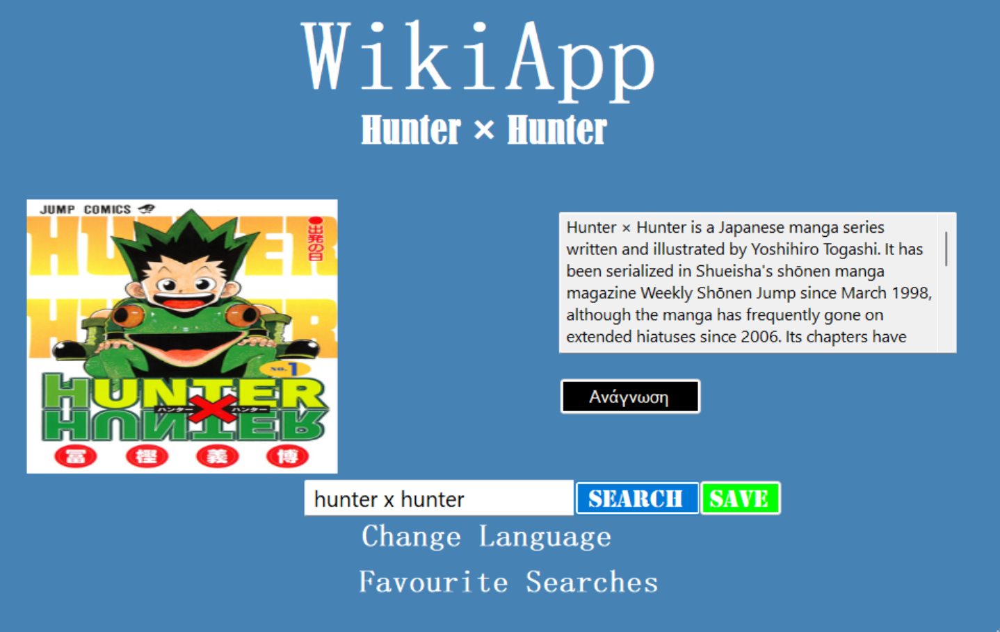

# WikiApp – Desktop Wikipedia Browser & Search Manager

A Windows Forms desktop application that allows users to search Wikipedia articles, view summaries and images, listen to content using speech synthesis, and manage a persistent list of favourite searches.

---

## Table of Contents
- [About](#about)
- [Getting Started](#getting-started)
- [Prerequisites](#prerequisites)
- [Build and Run](#build-and-run)
- [Features](#features)
- [Using the Wikipedia API](#using-the-wikipedia-api)
- [Speech Synthesis](#speech-synthesis)
- [Favourite Searches](#favourite-searches)
- [Screenshots](#screenshots)
- [Project Structure](#project-structure)
- [Technologies Used](#technologies-used)
- [License](#license)

---

## About

**WikiForms** is a desktop application built in C# using Windows Forms that provides a clean and interactive way to browse Wikipedia content.

Users can search for articles in multiple languages, read concise summaries, view associated images, listen to article text through text-to-speech, and store favourite searches for later access.

The project demonstrates desktop UI design, API integration, asynchronous operations, speech synthesis, and persistent data handling within a Windows environment.

---

## Getting Started

The application can be run locally using Visual Studio without additional configuration beyond the required development tools.

---

## Prerequisites

Before opening the project, ensure you have the following installed:

- Windows operating system  
- Visual Studio 2022 (recommended)
- .NET Desktop Development workload
- Internet connection (required for Wikipedia API requests)
- Microsoft Voice Stefanos Downloaded

---

## Build and Run

1. Clone or download the repository:
   ```bash
   git clone https://github.com/yourusername/WikiForms.git
   2. Open the solution in Visual Studio:
   - Go to **File → Open → Project/Solution**
   - Select the `.sln` file

3. Restore NuGet packages if prompted.
   - Visual Studio usually restores them automatically.

4. Run the application.
   

---

## Features

- Wikipedia article search using live API queries
- Multi-language support:
  - English
  - Japanese
  - Russian
  - Greek
- Article title and summary display
- Article image preview (when available)
- Text-to-speech reading functionality
- Interactive and responsive Windows Forms interface
- Asynchronous API requests for smooth UI performance
- Supabase Database

---

## Using the Wikipedia API

The application retrieves article data using the official Wikipedia API.

The following information is fetched dynamically based on user input and selected language:

- Article titles
- Short descriptions and extracts
- Page images, when available

API requests are performed asynchronously, and results are displayed in real time directly in the interface.  
Errors such as “Article not found” or “No internet connection” are displayed as message boxes.

---

## Speech Synthesis

WikiForms integrates text-to-speech functionality using the Windows Speech API.

- Users can press the **Read** button to hear article summaries.
- Supports multiple languages (requires the respective installed voices in Windows, e.g., "Microsoft Stefanos" for Greek, "Microsoft David" for English).

---

## Favourite Searches

Users can save searches for later access:

- Saved searches appear in a table (DataGridView) with columns:
  - Name (article title)
  - Language
- Users can double-click a row to reload the saved article.
- Selected searches can be deleted.
- Data persists between sessions using a cloud or local database (Supabase).

---

## Screenshots





## Technologies Used

- **C#** (.NET Framework / .NET 6+)
- **Windows Forms (WinForms)** for GUI
- **Wikipedia REST API** (summary endpoint)
- **Newtonsoft.Json** for JSON parsing
- **System.Net.Http** for API requests
- **System.Speech.Synthesis** for text-to-speech
- **Supabase** or **SQLite** for persistent storage


---

## License

This project is provided for educational and demonstration purposes.

It is not licensed for commercial use without explicit permission from the author.
